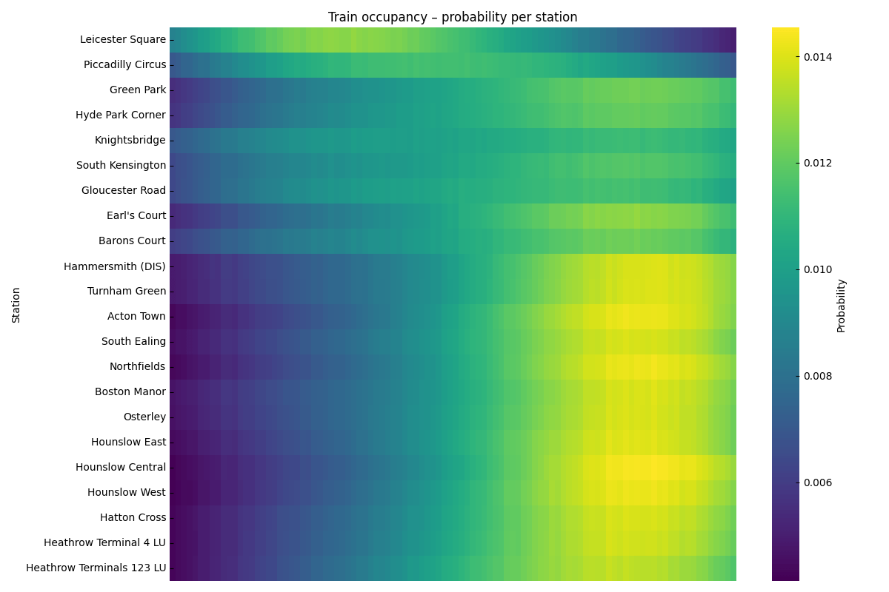

<p align="center">
  
  <br>
      London underground train car occupancy prediction
</p>

---

This project predicts train car occupancy on the London Underground using
a Gaussian mixture model. Station sequences for each line are
extracted from Transport for London data and used to estimate how many
passengers remain in each car after every stop. You can find an associated web app [here](https://3m4uez9a8p.us-east-1.awsapprunner.com/).

## Approach
- Build directed graphs of stations for each line and extract all branches.
- Use the assumption that passengers are distributed only around the entrances to the platforms.
- For a chosen branch, propagate boarding and alighting counts with vectorised
  JAX helpers to estimate how many riders remain in a car after each stop.
- Use these counts to sample passenger locations and compute the expected
  occupancy at every station.

## Outputs
Running the model yields:

- **Expected train-car occupancy per station** – the predicted number of riders in a car when the train arrives at each stop.

<p align="center">
  
</p>

- **Passenger location samples** – draws from a mixture distribution describing
  where passengers stand within a car.

<p align="center">
  
</p>

## Status
Only the **Piccadilly line** is currently included at the moment.

## Development
Install dependencies and run the tests with Poetry:

```bash
poetry install --no-root
poetry run pytest -q
```
